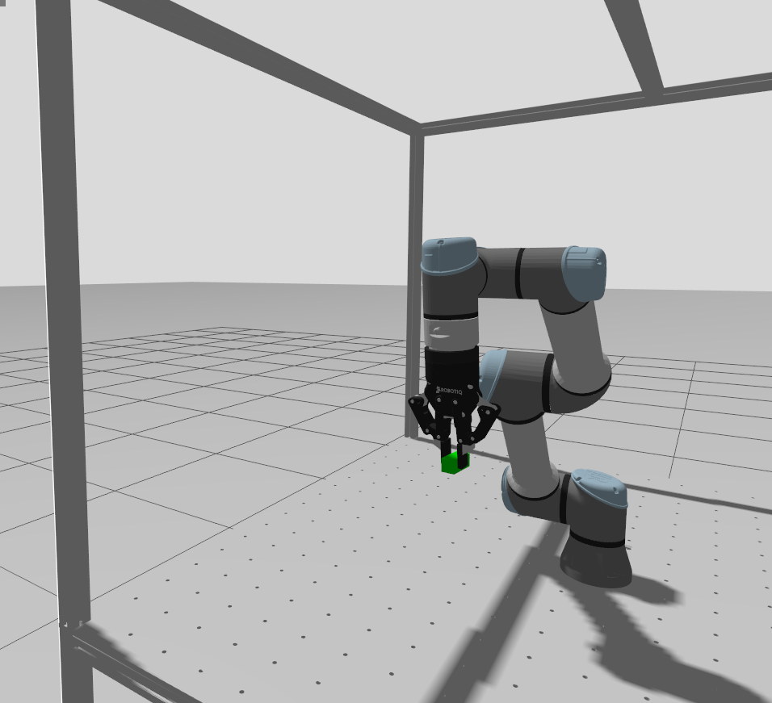

# Robot-Table Setup
Software prerequisites:
*TO DO*

## Simulation 🚀


Start Gazebo Simulation: 
```bash
ros2 launch robot_table_gazebo sim_control.launch.py 
```
> [!WARNING]
> Before launching the Gazebo simulation, some Gazebo environment variables need to be set. 

```bash
export GZ_SIM_RESOURCE_PATH=$GZ_SIM_RESOURCE_PATH:~/ros2_ws/install/robot_table_description/share
export GZ_SIM_RESOURCE_PATH=$GZ_SIM_RESOURCE_PATH:~/ros2_ws/install/robotiq_description/share
export GZ_SIM_RESOURCE_PATH=$GZ_SIM_RESOURCE_PATH:/opt/ros/jazzy/share
```

Start Moveit MoveGroup:
```bash
ros2 launch robot_table_moveit_config move_group.launch.py
```

Set MoveGroup Time to Simulator Time:
```bash
ros2 param set /move_group use_sim_time true
```

🚀 Start Gazebo Simulation + Moveit MoveGroup + MoveGroup Simulator Time all at once 🚀:
```bash
ros2 launch robot_table_gazebo bringup_sim.launch.py
```

Start Rviz:
```bash
ros2 launch robot_table_moveit_config moveit_rviz.launch.py
```

Now the robot can be controlled in the Gazebo simulation using MoveIt. Additionally, it is possible to control the robot directly via the same ROS 2 actions that are used by the MoveIt interface:

UR5e:
```bash
ros2 action send_goal /scaled_joint_trajectory_controller/follow_joint_trajectory control_msgs/action/FollowJointTrajectory "{
  trajectory: {
    joint_names: [
      'ur5e_shoulder_pan_joint',
      'ur5e_shoulder_lift_joint',
      'ur5e_elbow_joint',
      'ur5e_wrist_1_joint',
      'ur5e_wrist_2_joint',
      'ur5e_wrist_3_joint'
    ],
    points: [{
      positions: [0.0, -1.0, 1.0, -1.5, -0.5, 0.0],
      velocities: [0.0, 0.0, 0.0, 0.0, 0.0, 0.0],
      time_from_start: { sec: 5, nanosec: 0 }
    }]
  }
}"
```

Gripper:

Open:
```bash
ros2 action send_goal /robotiq_gripper_controller/gripper_cmd control_msgs/action/GripperCommand "{                           
  command: {position: 0.1, max_effort: 300.0}
}"
```

Close: 
```bash
ros2 action send_goal /robotiq_gripper_controller/gripper_cmd control_msgs/action/GripperCommand "{                           
  command: {position: 0.8, max_effort: 300.0}
}"
```

> [!NOTE]
> Perception sensors still need to be integrated in order to simulate the complete setup.

How to spawn objects in Simulation: 
```bash
ros2 launch ros_gz_sim gz_spawn_model.launch.py file:=$HOME/ros2_ws/src/robot_table/robot_table_gazebo/objects/klotz.sdf x:=0.0 y:=0.0 z:=5.0 name:=Klotz
```

## Mock Hardware ⚙️
Before controlling the real robot, you can also test what would happen by visualizing the robot’s motions in rviz.

```bash
ros2 launch robot_table_control start_robot.launch.py use_mock_hardware:=true launch_rviz:=false
```

## Real Robot 🤖
Listen to tool communication port: 
```bash
ros2 launch robot_table_control ur_tool_communication.launch.py
```

Start robot and gripper ros2 controller: 
```bash
ros2 launch robot_table_control start_robot.launch.py use_mock_hardware:=false launch_rviz:=false
```

Load external Control URCap on teach panel:
```bash
ros2 service call /dashboard_client/load_program ur_dashboard_msgs/srv/Load "filename: external_control.urp"
```

Start the URCap: 
```bash
ros2 service call /dashboard_client/play std_srvs/srv/Trigger {}
```

Start Moveit Movegroup: 
```bash
ros2 launch robot_table_moveit_config move_group.launch.py
```

Start Moveit Rviz: 
```bash
ros2 launch robot_table_moveit_config moveit_rviz.launch.py 
```

🚀 Start Tool Communication + Robot & Gripper + URCap all at once 🚀:
```bash
ros2 launch robot_table_control bringup_real_robot.launch.py
```

# Camera 📸

```bash
ros2 launch realsense2_camera rs_launch.py 
```